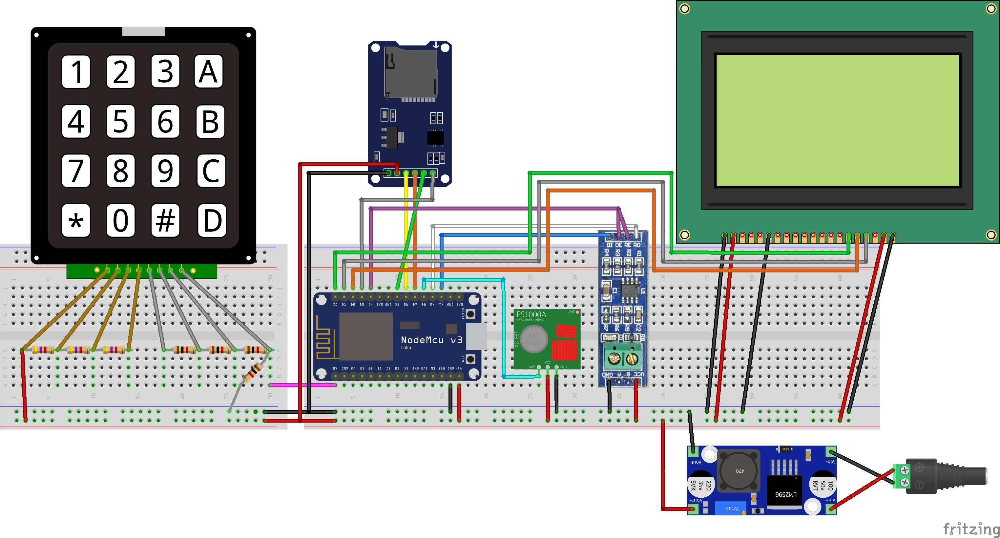
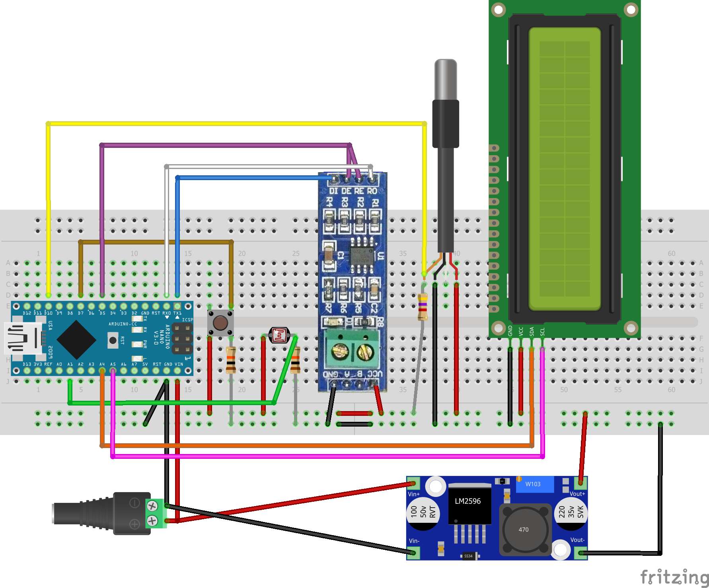
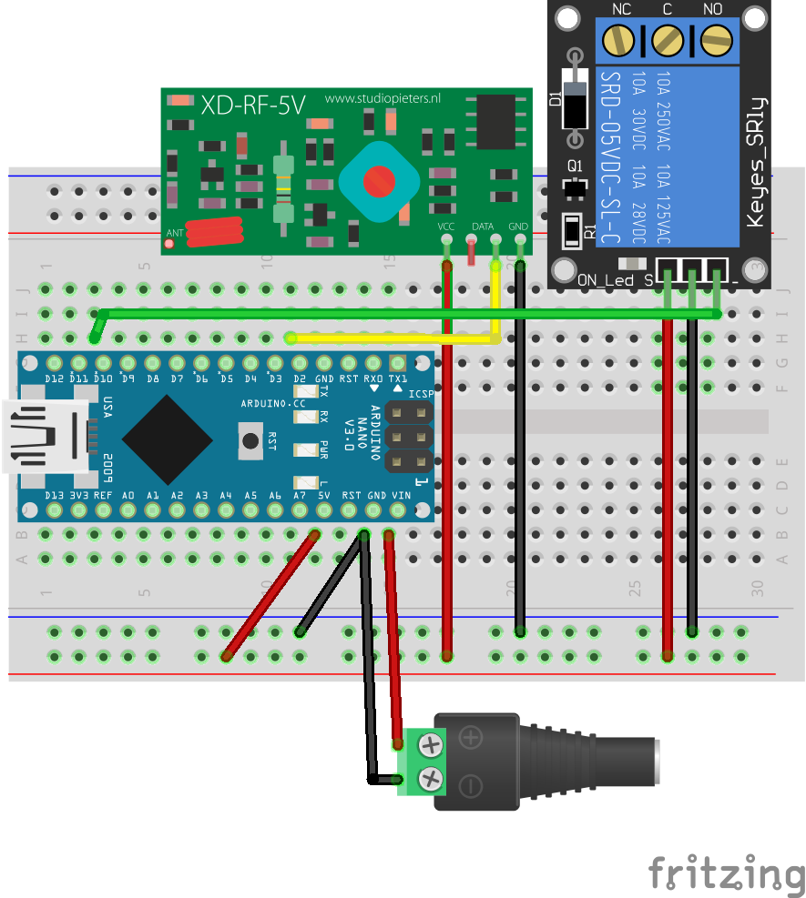

# Weather statation using Modbus RTU via RS-485
video:

## Master circuit

## Slave circuit

## Alarm receiver circuit

## Additional Boards Manager URLs
http://arduino.esp8266.com/stable/package_esp8266com_index.json,https://mcudude.github.io/MiniCore/package_MCUdude_MiniCore_index.json
